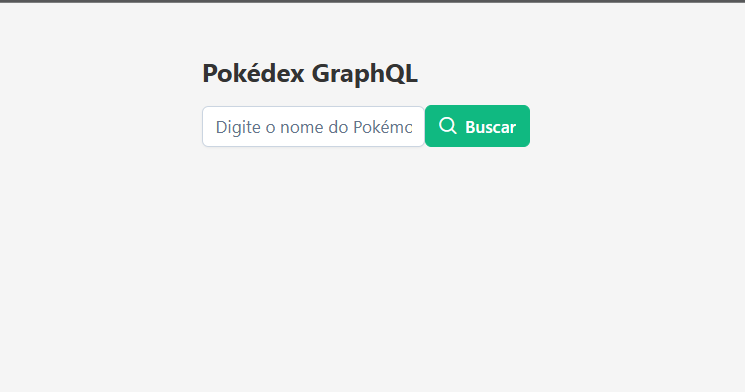
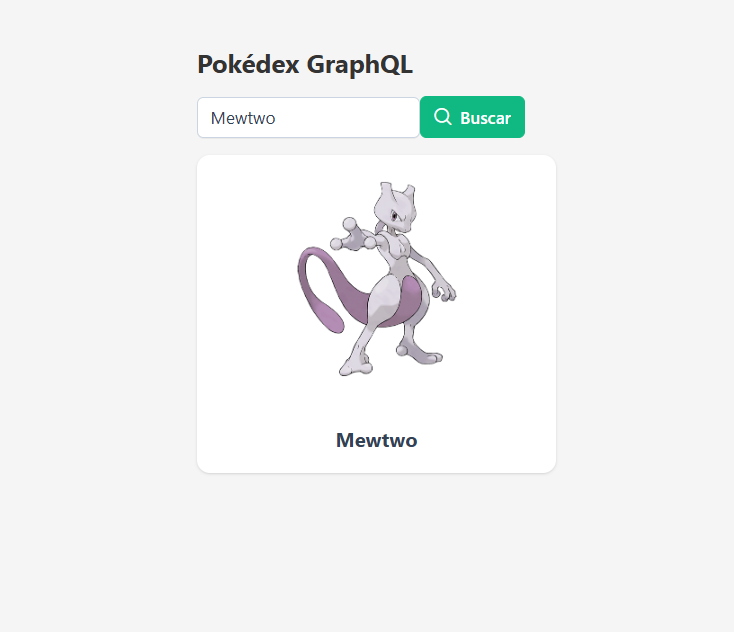

# 🚀 Pokédex GraphQL

Uma aplicação moderna de busca de Pokémon construída com **Angular 18**, **GraphQL**, **Apollo Client v4** e **PrimeNG**.


---

## 📖 Sobre o Projeto

**Pokédex GraphQL** é uma aplicação que demonstra como criar uma interface moderna de busca utilizando as melhores práticas de desenvolvimento:

- ✅ **GraphQL** para queries eficientes
- ✅ **Apollo Client v4** com tipagem forte
- ✅ **Angular 18** standalone components
- ✅ **PrimeNG** com tema Aura
- ✅ **TypeScript** com interfaces tipadas
- ✅ **Service Layer** para separação de responsabilidades

### 🎯 Funcionalidades

- 🔍 **Busca de Pokémon** por nome
- 🖼️ **Imagens oficiais** do Pokémon
- ⚡ **Loading spinner** durante requisição
- ❌ **Tratamento de erros** com fallback
- 📱 **UI responsiva** com PrimeNG

---

## � Screenshots

### 🔍 Busca de Pokémon


_Tela de busca com input e botão de busca estilizados com PrimeNG_

### ✅ Resultado da Busca


_Exibição do Pokémon encontrado com imagem oficial, nome e ID_

---

## �🛠️ Stack Tecnológico

| Tecnologia        | Versão  | Propósito          |
| ----------------- | ------- | ------------------ |
| **Angular**       | 18      | Framework frontend |
| **TypeScript**    | 5       | Linguagem tipada   |
| **Apollo Client** | v4      | Cliente GraphQL    |
| **PrimeNG**       | 18      | Componentes UI     |
| **PokéAPI**       | GraphQL | API de dados       |

---

## 📂 Estrutura do Projeto

```
src/
├── app/
│   ├── app.config.ts                    ⭐ Config Angular + PrimeNG
│   ├── app.component.ts                 (Componente raiz)
│   │
│   ├── models/
│   │   └── pokemon.model.ts             ⭐ Interfaces tipadas
│   │       ├── Pokemon
│   │       ├── PokemonSpecies
│   │       ├── PokemonRestResponse
│   │       └── GetPokemonQueryResult
│   │
│   ├── graphql/
│   │   ├── apollo.client.ts             ⭐ Instância Apollo
│   │   │   └── ApolloClient com HttpLink
│   │   └── queries.ts                   ⭐ Queries GraphQL
│   │       └── GET_POKEMON_BY_NAME
│   │
│   └── pages/
│       ├── services/
│       │   └── pokemon.service.ts       ⭐ Lógica de API
│       │       ├── buscarPokemonPorNome()
│       │       └── buscarImagem()
│       │
│       └── pokemon-details/
│           ├── pokemon-details.component.ts      (~40 linhas)
│           ├── pokemon-details.component.html    (UI limpa)
│           └── pokemon-details.component.css     (Estilos)
│
├── main.ts                              (Entry point)
└── styles.css                           (Global styles)
```

---

## 🚀 Como Rodar o Projeto

### 📋 Pré-requisitos

- **Node.js** 18+
- **npm** 10+
- **Angular CLI** 18+

### 1️⃣ Clonar o Repositório

```bash
git clone https://github.com/TiagoBarbosa88/pokedex_graphql.git
cd pokemon-graphql-app
```

### 2️⃣ Instalar Dependências

```bash
npm install
```

### 3️⃣ Rodar o Servidor de Desenvolvimento

```bash
npm start
```

Ou usando Angular CLI:

```bash
ng serve
```

### 4️⃣ Abrir no Navegador

Acesse: **http://localhost:4200**

---

## 📖 Como Usar

1. Digite o nome de um Pokémon no input

   - Ex: `pikachu`, `charizard`, `blastoise`

2. Aperte **Enter** ou clique em **Buscar**

3. Veja:
   - ✅ Imagem oficial do Pokémon
   - ✅ Nome formatado

---

## 🔌 API GraphQL

### Endpoint

```
https://graphql.pokeapi.co/v1beta2
```

### Query Utilizada

```graphql
query GetPokemon($name: String!) {
  pokemonspecies(where: { name: { _ilike: $name } }, limit: 1) {
    id
    name
  }
}
```

**Por que GraphQL?**

- Especificidade: pede só o que precisa
- Performance: uma única requisição
- Type-safe: schema definido
- Autocompletar: IDE ajuda

---

## 🔧 Tecnologias em Detalhes

### Angular 18 + Standalone

```typescript
@Component({
  selector: 'app-pokemon-details',
  standalone: true,  // ✅ Sem NgModule
  imports: [...]     // ✅ Imports diretos
})
```

### Apollo Client v4

```typescript
export const apolloClient = new ApolloClient({
  link: new HttpLink({ uri: "..." }),
  cache: new InMemoryCache(),
});
```

### Tipagem Forte

```typescript
const resultado = await apolloClient.query<GetPokemonQueryResult>({
  // ✅ Type-safe, sem <any>
});
```

### Service Layer

```typescript
@Injectable({ providedIn: "root" })
export class PokemonService {
  async buscarPokemonPorNome(nome: string): Promise<Pokemon> {
    // ✅ Lógica centralizada
    // ✅ Reutilizável
  }
}
```

---

## 📦 Build para Produção

```bash
ng build --configuration production
```

Artifacts serão gerados em `dist/pokemon-graphql-app/`

---

## 🧪 Testes

### Rodar testes unitários

```bash
ng test
```

### Verificar linting

```bash
ng lint
```

---

## 📚 Recursos Úteis

- 📖 **[Guia Completo do Projeto](./GUIA_CORRETO.md)** - Passo a passo detalhado
- 🎨 **[PrimeNG Documentation](https://primeng.org/)**
- 📡 **[Apollo Client Docs](https://www.apollographql.com/docs/react/)**
- 🐳 **[PokéAPI GraphQL Playground](https://graphql.pokeapi.co/v1beta2)**
- 📚 **[Angular Docs](https://angular.io/)**

---

## ✨ Destaques de Boas Práticas

- ✅ **Tipagem forte** - Sem `any`, tudo tipado
- ✅ **Separação de responsabilidades** - Service + Component
- ✅ **Componentes limpos** - ~40 linhas apenas
- ✅ **Async/await** - Código legível
- ✅ **Try/catch/finally** - Tratamento de erros
- ✅ **Validação de input** - Segurança
- ✅ **Fallback de imagem** - UX resiliente
- ✅ **Apollo v4 moderno** - Padrão atualizado

---

## 🎯 Próximos Passos

1. **Lista paginada** - Mostrar todos os Pokémon
2. **Cache inteligente** - Apollo InMemoryCache
3. **Detalhes expandidos** - Habilidades, tipos, stats
4. **Favoritos** - LocalStorage
5. **Testes E2E** - Cypress/Playwright
6. **Deploy** - Vercel / Netlify / Firebase

---

## 👨‍💻 Autor

**Tiago Barbosa**

- 🐙 GitHub: [@TiagoBarbosa88](https://github.com/TiagoBarbosa88)
- 📦 Repositório: [pokedex_graphql](https://github.com/TiagoBarbosa88/pokedex_graphql)

---

## 📄 Licença

Este projeto é open source e está disponível sob a licença MIT.

---

## 🙏 Agradecimentos

- **PokéAPI** - Dados gratuitos de Pokémon
- **Angular Team** - Framework incrível
- **Apollo GraphQL** - Cliente GraphQL moderno
- **PrimeNG** - Componentes UI de qualidade

---

**Status:** ✅ Testado e funcionando perfeitamente!

**Última atualização:** 29 de dezembro de 2025
